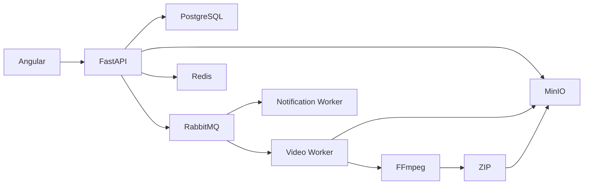

# FIAP X

Fundação de uma plataforma assíncrona de processamento de vídeos para o Hackathon Pós-Tech FIAP.

## Arquitetura



O PostgreSQL é a fonte persistente. Redis é reservado para estado efêmero de progresso/status. RabbitMQ transporta apenas contratos e referências de objetos, nunca arquivos completos.

## Stack

- Angular 22, TypeScript, Signals, Material e Tailwind.
- Python 3.14, FastAPI, Pydantic 2, SQLAlchemy 2, Alembic e uv.
- PostgreSQL, Redis, RabbitMQ, MinIO e workers independentes.

## Requisitos

Docker Desktop com Compose, Node.js 22.22.3+/npm e Python 3.14 com uv para desenvolvimento fora dos containers.

## Executar

```powershell
Copy-Item .env.example .env
docker compose up -d --build
docker compose run --rm api alembic upgrade head
```

URLs locais: API `http://localhost:8000/docs`, health `http://localhost:8000/health`, Angular `http://localhost:4200`, RabbitMQ `http://localhost:15672` e MinIO `http://localhost:9001`.

Para escalar workers: `docker compose up -d --scale video-worker=5`.

## Desenvolvimento e testes

```powershell
cd backend
uv sync
uv run pytest
uv run ruff check .
uv run mypy apps packages

cd ..\frontend
npm ci
npm run lint
npm test
npm run build
npm run e2e
```

O frontend usa `/api` como base URL (o proxy reverso do ambiente aponta para a API). O fluxo autenticado é login/register → token Bearer persistido localmente → Dashboard com `GET /videos`; uploads usam `POST /videos`, a atualização de vídeos ativos ocorre em um polling único de 5 segundos, detalhes usam `GET /videos/{id}` e downloads usam a URL presigned de `GET /videos/{id}/download`. O Playwright inicia o servidor Angular automaticamente. A rota `/notifications` continua com dados locais porque o backend atual ainda não expõe endpoint de notificações.

No Windows, os mesmos comandos podem ser executados dentro do PowerShell; o Makefile oferece atalhos em ambientes com GNU Make.

## Pipeline de processamento

`POST /videos` grava o original em `users/{user_id}/videos/{video_id}/original/{generated_name}`, cria o registro `QUEUED` e publica `video.uploaded` no exchange `fiapx.events`. O worker baixa o objeto, extrai um frame por segundo com FFmpeg, cria `frames.zip`, grava o resultado em `result/frames.zip` e atualiza PostgreSQL e Redis. O PostgreSQL é a fonte definitiva; o Redis exibe progresso efêmero por etapas.

Estados: `QUEUED`, `PROCESSING`, `COMPLETED` e `FAILED`. Erros são tentados até `VIDEO_PROCESSING_MAX_RETRIES`; depois a mensagem é publicada em `video.processing.failed` / `video.processing.dlq`.

## Endpoints

`POST /api/v1/auth/register`, `POST /api/v1/auth/login`, `POST /api/v1/auth/refresh`, `POST /api/v1/auth/logout`, `GET /health`, `GET /ready`, `GET /metrics`, `POST /api/v1/videos`, `GET /api/v1/videos`, `GET /api/v1/videos/{id}` e `GET /api/v1/videos/{id}/download`. Os endpoints de vídeo exigem `Authorization: Bearer <access_token>`.

O upload aceita `.mp4`, `.mov`, `.avi`, `.mkv` e `.webm`, com limite configurável em `MAX_UPLOAD_SIZE_BYTES`. A URL de download é presigned e expira conforme `DOWNLOAD_URL_EXPIRATION_SECONDS`.

## Exemplo de uso

```bash
TOKEN=$(curl -s http://localhost:8000/auth/register -H 'Content-Type: application/json' -d '{"name":"Ana","email":"ana@example.com","password":"secret"}' | jq -r .access_token)
curl -F file=@sample.mp4 -H "Authorization: Bearer $TOKEN" http://localhost:8000/videos
curl -H "Authorization: Bearer $TOKEN" http://localhost:8000/videos
curl -H "Authorization: Bearer $TOKEN" http://localhost:8000/videos/{video_id}
curl -H "Authorization: Bearer $TOKEN" http://localhost:8000/videos/{video_id}/download
```

## Troubleshooting

- Se `/ready` retornar 503, confirme PostgreSQL e a migration.
- Se uploads não forem publicados, verifique RabbitMQ em `15672`.
- Se o frontend não iniciar, rode `npm ci` dentro de `frontend`.
- Nunca commite `.env`; use `.env.example` como referência.
