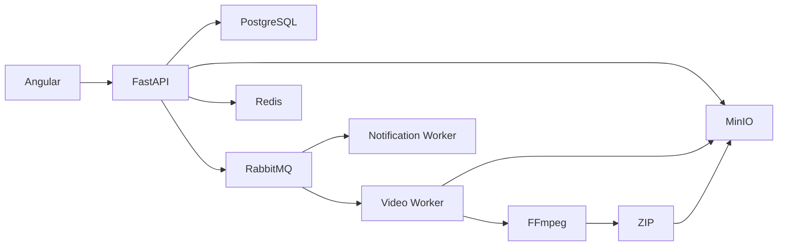
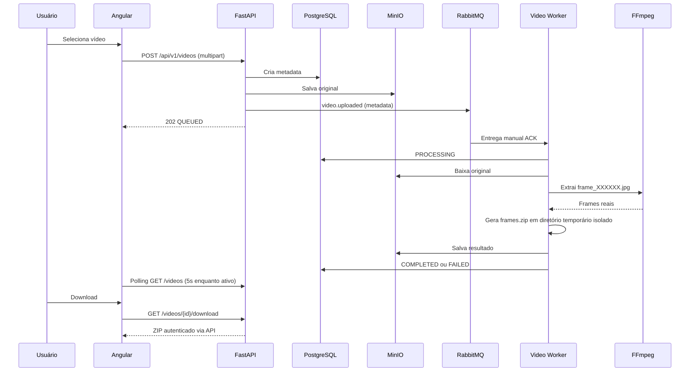

# FIAP X

Fundação de uma plataforma assíncrona de processamento de vídeos para o Hackathon Pós-Tech FIAP.

## Arquitetura



O PostgreSQL é a fonte persistente. Redis é reservado para estado efêmero de progresso/status. RabbitMQ transporta apenas contratos e referências de objetos, nunca arquivos completos.

## Fluxo E2E real



O exchange `fiapx.events`, as filas duráveis `video.processing`, `video.processing.retry` e `video.processing.dlq` são declarados por API e workers. Mensagens são persistentes, publisher confirms são habilitados e o worker usa `prefetch_count=1`. Falhas transitórias vão para retry com TTL e backoff/jitter; falhas definitivas ficam `FAILED` e vão para a DLQ. O outbox transacional fecha a janela entre commit PostgreSQL e publicação RabbitMQ.

## Stack

- Angular 22, TypeScript, Signals, Material e Tailwind.
- Python 3.14, FastAPI, Pydantic 2, SQLAlchemy 2, Alembic e uv.
- PostgreSQL, Redis, RabbitMQ, MinIO e workers independentes.

## Requisitos

Docker Desktop com Compose, Node.js 22.22.3+/npm e Python 3.14 com uv para desenvolvimento fora dos containers.

## Executar

```powershell
Copy-Item .env.example .env
docker compose up -d --build
docker compose run --rm api alembic upgrade head
```

No Windows, o Docker desta validação é executado pelo WSL:

```powershell
wsl -d Ubuntu-22.04 -- docker compose up -d --build
wsl -d Ubuntu-22.04 -- docker compose exec -T api alembic upgrade head
```

O WSL usa `8.8.8.8` como DNS em `/etc/resolv.conf`; confirme a conectividade com `wsl getent ahostsv4 registry-1.docker.io` antes do build.

URLs locais: API `http://localhost:8000/docs`, health `http://localhost:8000/health`, Angular `http://localhost:4200`, RabbitMQ `http://localhost:15672`, MinIO `http://localhost:9001`, Prometheus `http://localhost:9090` e Grafana `http://localhost:3000`.

Para escalar workers: `docker compose up -d --scale video-worker=5`. Para verificar a DLQ: `docker compose exec rabbitmq rabbitmqctl list_queues name messages_ready messages_unacknowledged`.

O teste E2E manual reproduzível é:

1. Suba os serviços e rode `docker compose run --rm api alembic upgrade head`.
2. Registre/login, envie um vídeo real com `POST /api/v1/videos` e confirme `202`/`QUEUED`.
3. Observe `docker compose logs -f video-worker`; o status deve avançar para `PROCESSING` e `COMPLETED`.
4. Consulte `GET /api/v1/videos/{id}/download/file` com o Bearer token e confirme que `frames.zip` é válido.
5. Para paralelismo, envie A/B/C e execute `docker compose up -d --scale video-worker=3`; cada job usa seu próprio diretório temporário.
6. Para resiliência, interrompa um worker durante FFmpeg (`docker compose stop video-worker`). Com ACK manual, RabbitMQ mantém a mensagem e a redeliverá quando outro worker estiver ativo.

## Desenvolvimento e testes

```powershell
cd backend
uv sync
uv run pytest
uv run ruff check .
uv run mypy apps packages

cd ..\frontend
npm ci
npm run lint
npm test
npm run build
npm run e2e
```

O frontend usa `/api` como base URL (o proxy reverso do ambiente aponta para a API). O fluxo autenticado é login/register → access token Bearer e refresh token em cookie HttpOnly → Dashboard com `GET /videos`; uploads usam `POST /videos`, a atualização de vídeos ativos ocorre em polling, e cada vídeo expõe percentual e etapa (`Baixando vídeo`, `Validando vídeo`, `Extraindo frames`, `Compactando ZIP`, `Enviando resultado` e `Concluído`). Detalhes usam `GET /videos/{id}` e downloads usam `GET /videos/{id}/download/file` como resposta ZIP autenticada. A tela `/notifications` consulta `GET /notifications` e permite marcar uma ou todas como lidas.

No Windows, os mesmos comandos podem ser executados dentro do PowerShell; o Makefile oferece atalhos em ambientes com GNU Make.

## Pipeline de processamento

`POST /videos` grava o original em `users/{user_id}/videos/{video_id}/original/{generated_name}`, cria o registro `QUEUED` e publica `video.uploaded` no exchange `fiapx.events`. O worker baixa o objeto, extrai um frame por segundo com FFmpeg, cria `frames.zip`, grava o resultado em `result/frames.zip` e atualiza PostgreSQL e Redis. O PostgreSQL é a fonte definitiva; o Redis exibe progresso efêmero por etapas.

Estados: `QUEUED`, `PROCESSING`, `COMPLETED` e `FAILED`. Erros são tentados até `VIDEO_PROCESSING_MAX_RETRIES`; depois a mensagem é publicada em `video.processing.failed` / `video.processing.dlq`.

## Endpoints

`POST /api/v1/auth/register`, `POST /api/v1/auth/login`, `POST /api/v1/auth/refresh`, `POST /api/v1/auth/logout`, `GET /health`, `GET /ready`, `GET /metrics`, `POST /api/v1/videos`, `GET /api/v1/videos`, `GET /api/v1/videos/{id}`, `GET /api/v1/videos/{id}/download`, `GET /api/v1/videos/{id}/download/file`, `GET /api/v1/notifications`, `PATCH /api/v1/notifications/{id}/read` e `POST /api/v1/notifications/read-all`. Os endpoints de vídeo e notificações exigem `Authorization: Bearer <access_token>`.

O upload aceita `.mp4`, `.mov`, `.avi`, `.mkv` e `.webm`, com limite configurável em `MAX_UPLOAD_SIZE_BYTES`. O download retorna o ZIP autenticado diretamente pela API.

## Exemplo de uso

```bash
TOKEN=$(curl -s http://localhost:8000/auth/register -H 'Content-Type: application/json' -d '{"name":"Ana","email":"ana@example.com","password":"secret"}' | jq -r .access_token)
curl -F file=@sample.mp4 -H "Authorization: Bearer $TOKEN" http://localhost:8000/videos
curl -H "Authorization: Bearer $TOKEN" http://localhost:8000/videos
curl -H "Authorization: Bearer $TOKEN" http://localhost:8000/videos/{video_id}
curl -H "Authorization: Bearer $TOKEN" http://localhost:8000/videos/{video_id}/download
```

## Resiliência e operação

O lease `video:{video_id}:processing-lease` tem TTL e renovação pelo worker; a liberação é protegida por ownership. A transição para `PROCESSING` é um `UPDATE ... WHERE status=QUEUED`, portanto dois workers não vencem a mesma corrida. O resultado usa chave determinística `users/{user_id}/videos/{video_id}/result/frames.zip`. Logs devem ser filtrados por `video_id`, `worker_id` e `attempt`; eventos publicados pelo outbox carregam `event_id` e são tolerantes a duplicidade.

Consulte o [runbook de processamento](docs/runbooks/video-processing.md) e o dashboard versionado em `monitoring/grafana/dashboards/fiapx-overview.json`.

## Troubleshooting

- Se `/ready` retornar 503, confirme PostgreSQL e a migration.
- Se uploads não forem publicados, verifique RabbitMQ em `15672`.
- Se o frontend não iniciar, rode `npm ci` dentro de `frontend`.
- Nunca commite `.env`; use `.env.example` como referência.

## CI/CD e quality gates

Os workflows ficam em `.github/workflows/`:

- `backend-ci`: `uv sync --frozen`, Ruff format/lint, mypy, pytest com timeout, coverage e JUnit.
- `frontend-ci`: `npm ci`, TypeScript strict, testes, build de produção e smoke E2E Playwright.
- `ci-security`: CodeQL, pip-audit, npm audit e Gitleaks.
- `ci-containers`: build das imagens API/frontend/workers, Trivy e SBOM CycloneDX.
- `release`: tags `vMAJOR.MINOR.PATCH` publicam imagens versionadas no GHCR e criam GitHub Release.

Para reproduzir os gates localmente:

```powershell
cd backend
uv sync --frozen
uv run ruff format --check .
uv run ruff check .
uv run mypy apps packages
uv run pytest --cov=apps --cov=packages --cov-fail-under=20 --cov-report=term-missing --cov-report=xml --junitxml=test-results.xml --timeout=30

cd ..\frontend
npm ci
npm run lint
npm test
npm run build
npx playwright install chromium
npm run e2e
```

O gate inicial de coverage é 20%, compatível com a suíte smoke atual e sujeito a aumento conforme os testes de domínio, autenticação, ownership e resiliência cresçam. Os checks recomendados como obrigatórios na proteção da `main` são `backend-ci`, `frontend-ci`, `security` e `containers`. No GitHub, configure também PR obrigatório, branch atualizada, resolução de conversas, bloqueio de force-push e de exclusão da branch. Essa configuração é administrativa e não é criada automaticamente pelo repositório.

O versionamento segue SemVer: breaking change incrementa MAJOR, feature incrementa MINOR e correção incrementa PATCH. Consulte [docs/security.md](docs/security.md) e [SECURITY.md](SECURITY.md) para a política de segurança e supply chain.
