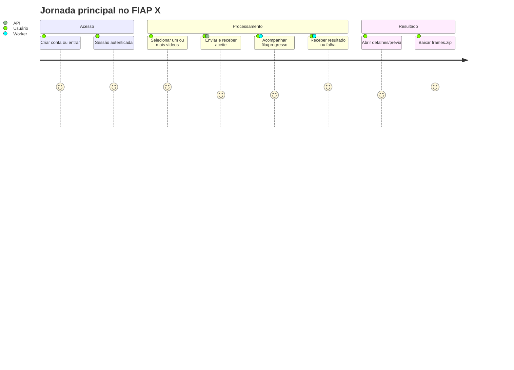
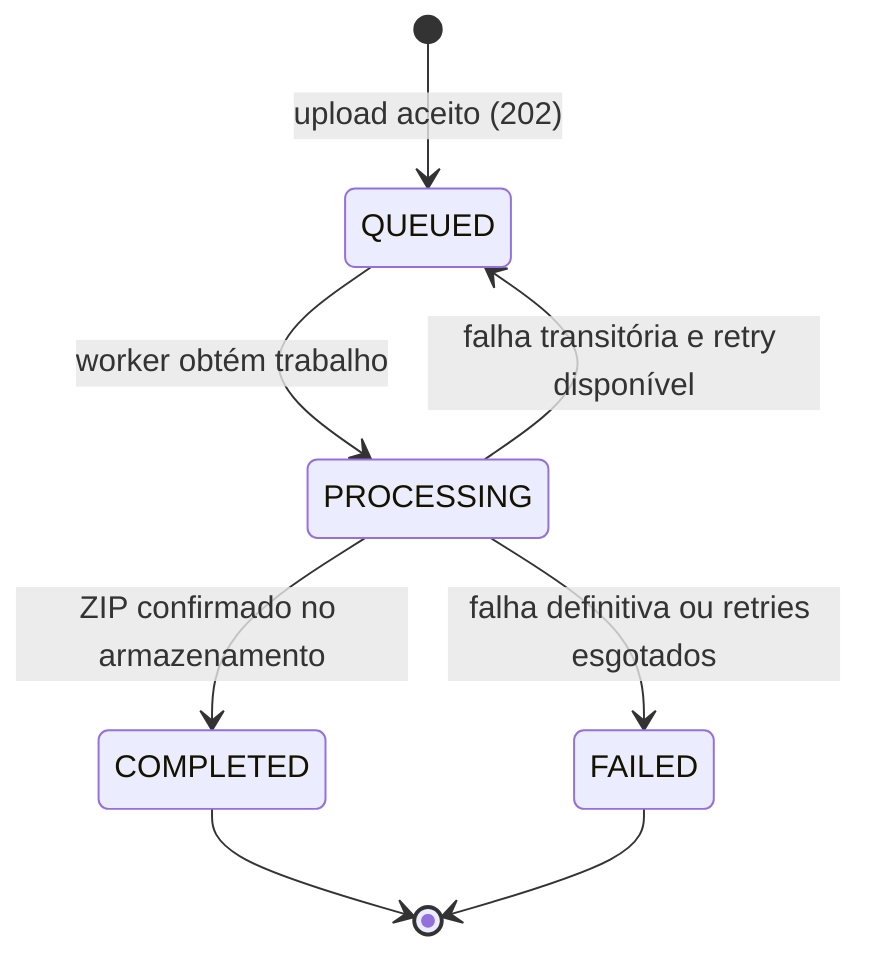

# FIAP X — Cenários de usuário

> Documento **as built**: descreve o comportamento implementado no repositório em 28/09/2026. Abrange os fluxos disponíveis ao usuário final e as respostas esperadas em condições normais e de exceção. Não representa funcionalidades futuras.

## 1. Visão do produto

FIAP X permite que uma pessoa autenticada envie vídeos para extrair imagens, uma por segundo. O processamento ocorre em segundo plano: o usuário não espera a conversão na requisição de upload, acompanha o estado e, quando concluído, baixa um arquivo `frames.zip`.

**Persona atual:** usuário autenticado, proprietário de seus vídeos e notificações. Não há papéis administrativos, compartilhamento entre usuários, recuperação de senha, edição de perfil ou reprocessamento manual implementados.

## 2. Mapa da jornada

## 3. Cenários de acesso e sessão

| ID | Cenário | Ação/condição | Resultado visível e regra aplicada |
|---|---|---|---|
| US-01 | Criar conta | Informa nome, e-mail, senha de 8+ caracteres e confirmação igual | A conta é criada, a sessão é iniciada e o Dashboard é aberto. |
| US-02 | Cadastro inválido no navegador | Deixa campos obrigatórios vazios, usa e-mail inválido, senha curta ou confirmação diferente | O formulário bloqueia o envio e informa o campo incorreto. |
| US-03 | E-mail já cadastrado | Tenta registrar um e-mail existente | A API responde `409`; a tela informa que o e-mail já está cadastrado. |
| US-04 | Entrar | Informa credenciais válidas | Recebe access token e cookie de refresh; é direcionado ao Dashboard. |
| US-05 | Credenciais incorretas | E-mail inexistente ou senha inválida | A API responde `401`; a tela exibe “E-mail ou senha inválidos.” |
| US-06 | Acesso a área protegida sem sessão | Navega para Dashboard, Meus Vídeos ou detalhes sem access token local | O guard redireciona para `/login`. |
| US-07 | Access token expirado | Uma chamada autenticada retorna `401` | O frontend usa o cookie de refresh uma vez, recebe novo access token e repete a chamada original. Se falhar, limpa a sessão. |
| US-08 | Refresh inválido, expirado ou revogado | Tenta renovar sem cookie/token válido | A API responde `401`; a sessão no cliente é removida na próxima chamada que necessitar renovação. |
| US-09 | Sair | Clica em “Sair” | A sessão de refresh é revogada, o cookie é removido, os dados locais são limpos e a tela de login é aberta. Mesmo se a API falhar, o cliente sai localmente. |

## 4. Cenários de vídeo

| ID | Cenário | Ação/condição | Resultado visível e regra aplicada |
|---|---|---|---|
| US-10 | Abrir Dashboard vazio | Usuário ainda não enviou vídeos | É exibido estado inicial, sem itens ativos, concluídos ou com falha. |
| US-11 | Selecionar um vídeo válido | Escolhe ou arrasta arquivo `.mp4`, `.mov`, `.avi`, `.mkv` ou `.webm` de até 500 MiB | O arquivo entra na seleção do modal de upload. |
| US-12 | Selecionar vários vídeos válidos | Escolhe/arrasta mais de um arquivo | Todos são selecionados e enviados um após o outro, na ordem escolhida; não há upload paralelo no navegador. |
| US-13 | Selecionar formato não permitido | Arquivo sem extensão aceita ou sem extensão | O navegador recusa a seleção e mostra o nome do arquivo com formato não suportado. |
| US-14 | Selecionar arquivo acima do limite | Arquivo maior que 524.288.000 bytes | O navegador bloqueia a seleção e informa limite de 500 MB. A API repete a validação e responderá `413` se o cliente for contornado. |
| US-15 | Enviar sem selecionar arquivo | Aciona envio com seleção vazia | A interface não inicia o upload. |
| US-16 | API rejeita upload | Arquivo vazio, extensão inválida, MIME incompatível, tamanho excedido ou erro de infraestrutura | O item não é aceito; a interface informa quantos vídeos não puderam ser enviados. Para extensão/MIME/tamanho, a API responde respectivamente `400`, `400` e `413`. |
| US-17 | Upload aceito | A API recebe o original, o armazena e persiste o trabalho | Resposta `202` com estado `QUEUED` (na fila). O processamento seguirá de modo assíncrono. |
| US-18 | Acompanhar fila e processamento | Há vídeo em `QUEUED` ou `PROCESSING` | O Dashboard consulta a lista a cada 1 s enquanto existir item ativo; mostra percentual e etapa. |
| US-19 | Processamento concluído | Vídeo é válido e todas as etapas terminam | Estado passa a `COMPLETED`, progresso a 100%, miniatura pode ser exibida e o download é habilitado. |
| US-20 | Falha definitiva | O arquivo não contém stream de vídeo, excede duração/resolução, FFmpeg falha de forma definitiva ou não gera frames | Estado passa a `FAILED`, a causa é armazenada e uma notificação de falha é criada. |
| US-21 | Falha transitória | Uma dependência/execução falha temporariamente | O trabalho volta a `QUEUED` e é reenviado com backoff. Após esgotar tentativas, torna-se `FAILED`. |
| US-22 | Consultar “Meus vídeos” | Abre a biblioteca | Vê somente vídeos `COMPLETED` de sua propriedade, ordenados por data e paginados na UI em 10 itens. Itens em fila, processando ou falhos permanecem no Dashboard. |
| US-23 | Abrir detalhes | Abre `/videos/{id}` de um vídeo próprio | Vê dados, linha do tempo, estado, progresso e prévia do original. Se não existir ou for de outro usuário, recebe `404` e a tela mostra erro. |
| US-24 | Ver prévia | Abre os detalhes de vídeo próprio | A UI requisita o original autenticado. Falha de leitura não impede os demais detalhes; apenas a prévia fica indisponível. |
| US-25 | Ver miniatura | Há vídeo concluído | A UI requisita o primeiro frame do ZIP. Se não houver miniatura/arquivo, a miniatura simplesmente não aparece. |
| US-26 | Baixar resultado | Clica em “Baixar ZIP” para item concluído | Recebe `frames.zip` por resposta autenticada. Antes da conclusão, para outro usuário ou resultado inexistente, o serviço responde `404`. |
| US-27 | Excluir vídeo via API | Cliente autorizado chama `DELETE /api/v1/videos/{id}` | A API remove original, resultado quando existente e registro; retorna `204`. Esta operação **não possui ação exposta na UI atual**. |

## 5. Estados e feedback do processamento

| Estado | Significado para o usuário | Etapas exibidas quando aplicável |
|---|---|---|
| `QUEUED` | Upload foi aceito; aguarda worker ou nova tentativa. | “Aguardando processamento” ou “Aguardando nova tentativa”. |
| `PROCESSING` | Um worker está tratando exclusivamente o vídeo. | Preparando processamento; Baixando vídeo (10%); Validando vídeo (25%); Extraindo frames (35%); Frames extraídos (70%); Compactando ZIP (80%); Enviando resultado (90%). |
| `COMPLETED` | O ZIP existe e pode ser baixado. | Concluído (100%). |
| `FAILED` | Não há resultado disponível para download. | Falha no processamento (0%) e mensagem técnica limitada a 500 caracteres quando disponível. |

`UPLOADING` existe no contrato e no banco como estado reservado, porém o fluxo atual persiste o vídeo diretamente como `QUEUED` depois de transferir o arquivo ao armazenamento.

## 6. Cenários de notificações

| ID | Cenário | Resultado |
|---|---|---|
| US-28 | Processamento concluído | É criada uma notificação `VIDEO_COMPLETED` com link ao vídeo e orientação para baixar o ZIP. |
| US-29 | Processamento falha | É criada uma notificação `VIDEO_FAILED` com título e mensagem de erro. |
| US-30 | Abrir sino | Carrega até oito notificações recentes no popover e mostra a contagem total de pendentes. |
| US-31 | Abrir central de notificações | Lista até 100 notificações do próprio usuário, agrupadas na interface. |
| US-32 | Abrir notificação pendente | Ela é marcada como lida e o usuário é levado aos detalhes do vídeo, mesmo se a marcação falhar. |
| US-33 | Marcar uma ou todas como lidas | Atualiza estado para `READ` e grava `read_at`; itens já lidos permanecem lidos. |
| US-34 | Consultar notificação de outro usuário/inexistente | A API responde `404`; nenhuma informação é revelada. |

## 7. Situações não atendidas ou deliberadamente fora do escopo

- Não há recuperação ou troca de senha, confirmação de e-mail, MFA, administração de usuários ou perfil.
- Não há cancelamento, reprocessamento, compartilhamento ou edição do vídeo pela interface.
- Não há paginação de notificações no contrato; são retornadas no máximo 100 por requisição.
- Não há garantia de exibição em tempo real por push: o progresso usa polling a cada segundo.
- A prévia entrega o vídeo original integral pela API; não há transcodificação específica para streaming.
- O download só entrega `frames.zip`; não há download individual de frames ou escolha de frequência na UI.

## 8. Critérios de aceite da jornada principal

1. Um novo usuário consegue criar conta, entrar e sair.
2. Um vídeo dentro dos limites é aceito com `202`, aparece em fila, alcança `COMPLETED` e gera ZIP válido.
3. Um arquivo com extensão permitida mas conteúdo inválido chega a `FAILED`, não oferece download e gera notificação.
4. Usuário A nunca lista, lê, baixa, visualiza ou exclui conteúdo do usuário B; a API devolve `404` nesses recursos.
5. Uma interrupção transitória não perde o trabalho: ele volta à fila até o limite configurado de tentativas.
