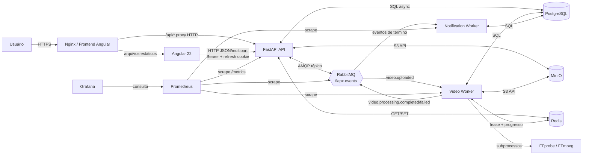
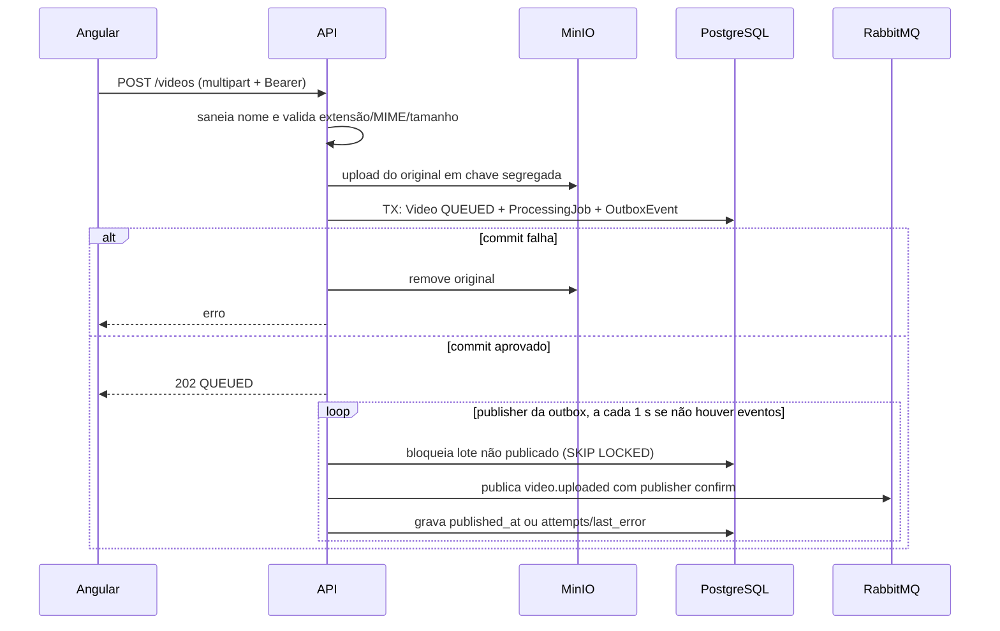
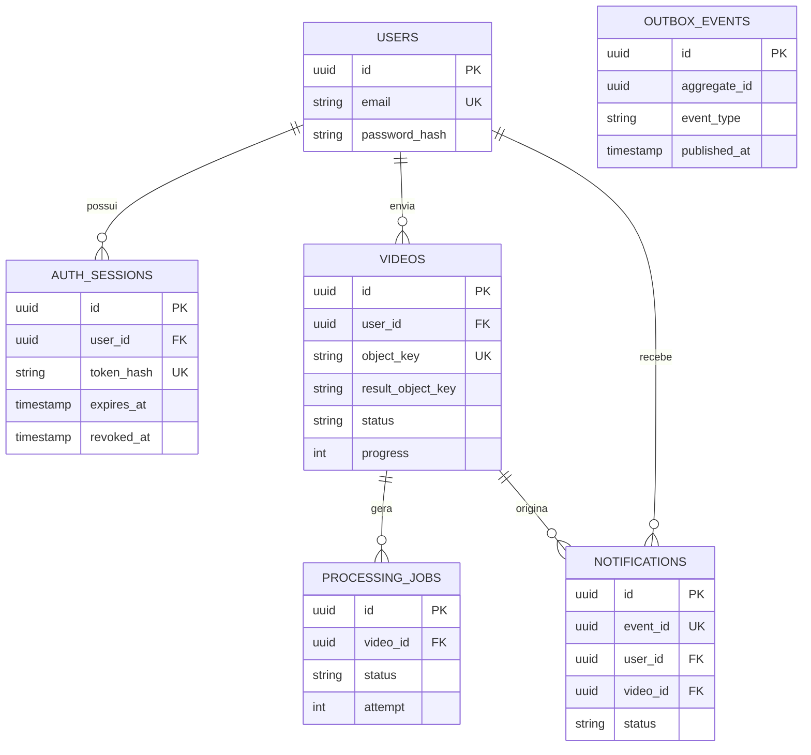

# FIAP X — Arquitetura e comunicação

> Documento **as built**: arquitetura observada no repositório em 28/09/2026. O foco é mostrar responsabilidades, limites e os protocolos de comunicação.

## 1. Estilo arquitetural

O FIAP X combina uma aplicação web SPA com uma API HTTP e um pipeline orientado a eventos. A decisão central é separar a requisição rápida de upload do trabalho pesado de análise/conversão: a API persiste a intenção, publica o evento de modo confiável e workers independentes executam processamento e notificações.



## 2. Componentes e responsabilidades

| Camada/componente | Responsabilidade | Interfaces principais | Estado que possui |
|---|---|---|---|
| Angular 22 SPA | Experiência do usuário: acesso, upload, acompanhamento, biblioteca, detalhes e notificações. | HTTP para `/api/v1`; browser storage/cookie. | Access token e usuário em `localStorage`; URLs temporárias de preview/miniatura. |
| Nginx | Serve os arquivos compilados da SPA e encaminha `/api/` ao serviço `api`. | HTTP interno `api:8000`. | Sem estado de domínio; limite de corpo de 500 MB. |
| FastAPI API | Contrato REST, autenticação, autorização por dono, upload, downloads, consulta de dados e publisher da outbox. | HTTP/JSON/multipart, SQL, AMQP, S3, Redis. | Não retém sessão em memória; usa PostgreSQL e MinIO. |
| PostgreSQL 16 | Fonte definitiva de usuários, sessões, vídeos, trabalhos, notificações e outbox. | SQLAlchemy async/Alembic. | Estado durável do domínio. |
| MinIO | Armazena binários: original e `frames.zip`. | API compatível com S3. | Objetos segregados por usuário/vídeo. |
| RabbitMQ 3.13 | Desacopla upload, processamento e notificação. | AMQP, exchange topic `fiapx.events`. | Mensagens persistentes e filas duráveis. |
| Video Worker | Valida mídia, extrai frames, compacta ZIP, atualiza estados/progresso e publica término. | AMQP, SQL, S3, Redis, `ffprobe`/`ffmpeg`. | Temporários isolados, sem estado de negócio durável próprio. |
| Notification Worker | Consome término e persiste notificação idempotente. | AMQP e SQL. | Sem estado próprio; deduplicação no banco. |
| Redis 7 | Coordena exclusão mútua de processamento e expõe progresso atual de baixa latência. | Chaves/TTL e scripts Lua. | Estado efêmero; não é fonte de verdade. |
| Prometheus e Grafana | Coleta e visualização de métricas de API, workers e broker. | HTTP `/metrics`. | Séries temporais e dashboards. |

## 3. Comunicação por fluxo

### 3.1 Autenticação e chamadas protegidas

```mermaid
sequenceDiagram
    participant B as Browser/Angular
    participant A as FastAPI
    participant P as PostgreSQL

    B->>A: POST /auth/register ou /auth/login
    A->>P: cria/valida usuário; cria auth_session com hash do refresh
    P-->>A: commit
    A-->>B: access JWT + Set-Cookie HttpOnly fiapx_refresh
    B->>A: chamada protegida com Authorization: Bearer JWT
    A->>P: carrega usuário a partir do sub do JWT
    A-->>B: recurso apenas se pertence ao usuário
    Note over B,A: Em 401, interceptor chama POST /auth/refresh e repete a chamada uma vez.
```

O access token é JWT HS256, expira em 15 minutos por padrão e é enviado no cabeçalho. O refresh token é opaco, armazenado no banco apenas como SHA-256, rotacionado no refresh e revogado no logout; chega ao navegador por cookie `HttpOnly`, `SameSite=Lax`, restrito a `/api/v1/auth`. Em ambiente não local/teste, o cookie é `Secure` e segredos padrão são rejeitados na inicialização.

### 3.2 Upload e publicação confiável



O outbox transacional elimina a janela em que o banco confirma o upload mas a publicação AMQP falha. O binário não trafega pelo RabbitMQ: a mensagem carrega IDs, chave do objeto, tentativa e `correlation_id`.

### 3.3 Processamento, retry e notificação

```mermaid
sequenceDiagram
    participant M as RabbitMQ
    participant W as Video Worker
    participant R as Redis
    participant P as PostgreSQL
    participant S as MinIO
    participant F as FFmpeg
    participant N as Notification Worker

    M->>W: video.uploaded (manual ACK)
    W->>R: lease NX com TTL; renovação periódica
    W->>P: QUEUED -> PROCESSING com update condicional
    W->>S: baixa original
    W->>F: ffprobe; ffmpeg fps=1/intervalo
    W->>S: grava frames.zip e confirma existência
    W->>P: COMPLETED + result_object_key
    W->>R: progresso 100 / Concluído
    W->>M: video.processing.completed
    M->>N: evento de término
    N->>P: INSERT notification ON CONFLICT DO NOTHING
    W-->>M: ACK somente após o fluxo terminar
```

Em falha transitória, o worker devolve o vídeo a `QUEUED` e publica a mesma intenção em `video.processing.retry` com TTL. Ao expirar, a mensagem retorna para `video.uploaded`. O atraso é exponencial com jitter: `min(max_delay, base_delay × 2^(tentativa-1)) + jitter`; defaults de 5 s, 300 s e até 2 s. A política permite novas tentativas enquanto `attempt < 3`. Em falha permanente ou limite atingido, o vídeo fica `FAILED`, o worker emite `video.processing.failed` e publica o marcador para a DLQ.

## 4. Topologia de mensageria

| Elemento | Tipo/durabilidade | Routing keys e finalidade |
|---|---|---|
| `fiapx.events` | Exchange `topic`, durável | Barramento de eventos de vídeo. |
| `video.processing` | Fila durável, `prefetch_count=1` por worker | Recebe `video.uploaded`; uma mensagem por worker em execução. |
| `video.processing.retry` | Fila durável com TTL por mensagem e dead-letter para exchange | Recebe `video.processing.retry`; ao expirar retorna a `video.uploaded`. |
| `video.processing.dlq` | Fila durável | Recebe `video.processing.failed`, inclusive dead-letter da fila principal. |
| `video.notification` | Fila durável | Escuta `video.processing.completed` e `video.processing.failed`. |

As mensagens têm corpo JSON validado por contratos Pydantic, `event_id`, IDs de vídeo/usuário/trabalho, versão de schema quando aplicável e tentativa. São persistentes e publicadas com publisher confirms. O consumidor faz ACK manual; se cair antes do ACK, o broker pode redeliver. A criação de notificação é idempotente por `event_id` único.

## 5. Modelo de dados e posse



Todas as consultas de vídeos e notificações aplicam `user_id == usuário autenticado`. Um recurso inexistente ou pertencente a outra pessoa retorna `404`, evitando revelar sua existência. Os objetos seguem as chaves determinísticas `users/{user_id}/videos/{video_id}/original/...` e `.../result/frames.zip`.

## 6. Consistência, concorrência e recuperação

| Risco | Mecanismo | Efeito |
|---|---|---|
| Commit do banco sem publicação AMQP | Outbox transacional + polling | Evento é publicado após a dependência retornar; não se perde silenciosamente. |
| Dois workers pegarem o mesmo vídeo | Lease Redis `SET NX EX` + update SQL `WHERE status=QUEUED` | Apenas um faz a transição efetiva a `PROCESSING`; o lease é renovado e liberado por ownership. |
| Worker interrompido | ACK manual e conexão AMQP robusta | A mensagem não confirmada pode ser entregue novamente. |
| Evento de término duplicado | `notifications.event_id` único e `ON CONFLICT DO NOTHING` | Uma única notificação é persistida. |
| Progresso Redis perdido | PostgreSQL recebe também `progress` e `progress_stage` | A API usa Redis como sobreposição quando disponível e banco como fallback persistente. |
| Arquivo órfão após falha | Compensação no upload; utilitário de inspeção/limpeza explícita | Se commit do upload falha, original é apagado; limpeza de órfãos só ocorre após revisão. |

## 7. Interfaces expostas

| Interface | Consumidor | Proteção/uso |
|---|---|---|
| `POST /api/v1/auth/register`, `/login`, `/refresh`, `/logout`, `GET /me` | SPA e clientes de API | Registro/login públicos; `/me` requer Bearer; refresh/logout usam cookie ou corpo para clientes não-browser. |
| `POST /api/v1/videos` | SPA | Multipart, Bearer; retorna `202`. |
| `GET/DELETE /api/v1/videos/{id}`, `GET /preview`, `/thumbnail`, `/download`, `/download/file` | SPA/cliente | Bearer e checagem de proprietário. |
| `GET /api/v1/videos` | SPA | Bearer; paginação 1..100 na API. |
| `GET /api/v1/notifications`, `PATCH /{id}/read`, `POST /read-all` | SPA | Bearer e checagem de proprietário. |
| `/health`, `/ready`, `/metrics` | Orquestração e observabilidade | Health simples; ready valida PostgreSQL e MinIO; métricas Prometheus. |

## 8. Implantação e operação

O Compose local sobe PostgreSQL, Redis, RabbitMQ, MinIO, API, video worker, notification worker, frontend, Prometheus e Grafana. API e frontend usam `restart: unless-stopped`; workers usam `restart: on-failure:5`. Cada video worker recebe limite de 2 CPUs, 2 GiB de memória e 256 PIDs para limitar impacto de conversões. A escala horizontal é feita com `docker compose up -d --scale video-worker=N`.

O pipeline CI valida formato/lint/tipagem/testes, build/E2E, dependências/segredos, imagens e SBOM. Releases SemVer publicam imagens imutáveis por SHA, tag de versão e, para API/frontend, `latest`, com provenance e SBOM.
